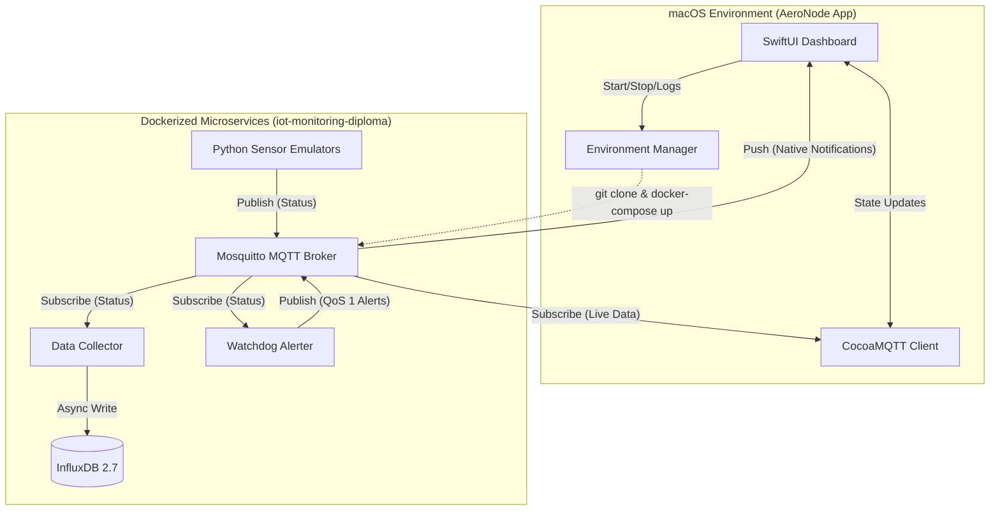

# AeroNode


A native macOS control center for real-time monitoring of IoT wind turbine fleets. Built with SwiftUI, this application serves as the frontend dashboard for a robust, event-driven microservices architecture. 

## 🏗 System Architecture

AeroNode is designed as a decoupled, scalable IoT pipeline. This repository contains the **macOS Frontend**. The entire backend simulation (sensors, databases, message brokers) is containerized and lives in a separate repository: **[iot-monitoring-diploma](https://github.com/365bv/iot-monitoring-diploma.git)**.

AeroNode automatically pulls, configures, and orchestrates this backend via Docker Compose upon first launch.



## 🚀 Features

- **Native macOS Dashboard:** Built with SwiftUI for a seamless, resource-efficient desktop experience.
- **Dynamic Cluster Scaling:** Spin up or tear down up to 100 wind turbine emulators instantly via MQTT control commands.
- **Real-time Telemetry:** Live data visualization (Power Output, Temperature, Wind Speed, Latency) using Apple's native Charts framework. Aggregates maximums and totals for fleet-wide monitoring.
- **On-the-fly QoS Switching:** Adjust MQTT Quality of Service (0, 1, or 2) in real-time to benchmark network pipelines, queue bottlenecks, and latency limits.
- **Automated Anomaly Detection:** Dedicated Python watchdog service triggers native macOS notifications for critical events (e.g., gearbox overheating).
- **Integrated Terminal:** Stream live Docker container logs (`docker-compose logs`) directly within the native macOS UI.

## 🛠 Tech Stack

- **Frontend:** Swift, SwiftUI, CocoaMQTT, Swift Charts
- **Backend (Cloned automatically):** Python (paho-mqtt, influxdb-client)
- **Infrastructure:** Docker, Docker Compose, zsh/shell integrations
- **Data & Messaging:** Mosquitto (MQTT), InfluxDB 2.7

## 📦 Installation

### Prerequisites
- macOS 26.4 or later.
- [Docker Desktop](https://www.docker.com/products/docker-desktop/) installed and running.

### Option 1: Install via Homebrew (Recommended)
You can install AeroNode directly using Homebrew:
```bash
brew tap 365bv/tap
brew install --cask aeronode
```

### Option 2: Manual Installation
1. Download the latest `AeroNode.dmg` from the [Releases](../../releases) page.
2. Open the `.dmg` file and drag `AeroNode.app` to your `/Applications` folder.

> **⚠️ Note on macOS Gatekeeper:**
> Since this is an open-source project without a paid Apple Developer signature, macOS Gatekeeper might block the app on the first launch. To bypass this, open Terminal and run:
> ```bash
> xattr -cr /Applications/AeroNode.app
> ```

## 🕹 Usage

1. **Launch AeroNode:** Open the app from your Applications folder.
2. **Environment Initialization:** The app will automatically verify your Docker daemon status, pull the latest microservices from the `develop` branch of the backend repository, and spin up the containers.
3. **Control the Matrix:** Use the Control Center in the sidebar to scale the active wind turbines and adjust the QoS level.
4. **Monitor & Debug:** Navigate between the *Overview* matrix, live *Telemetry* charts, and *Docker Logs* to observe the IoT pipeline in action.

## 👨‍💻 Author

**Vitalii Bazavluk**
- GitHub: [@365bv](https://github.com/365bv)

## 📄 License

This project is licensed under the MIT License - see the [LICENSE](LICENSE) file for details.
